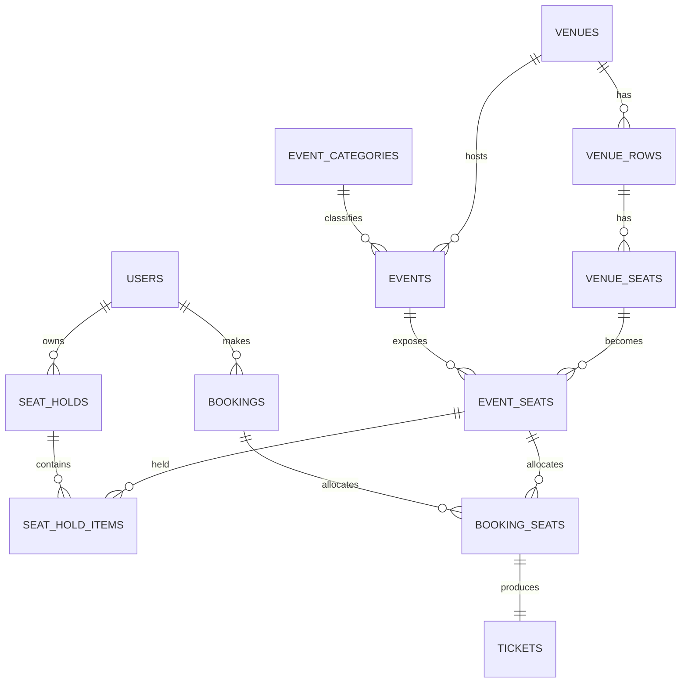

# ER diagram

```mermaid
erDiagram
  USERS ||--o{ BOOKINGS : makes
  USERS ||--o{ SEAT_HOLDS : owns
  EVENT_CATEGORIES ||--o{ EVENTS : classifies
  VENUES ||--o{ VENUE_ROWS : has
  VENUE_ROWS ||--o{ VENUE_SEATS : has
  VENUES ||--o{ EVENTS : hosts
  EVENTS ||--o{ EVENT_SEATS : exposes
  VENUE_SEATS ||--o{ EVENT_SEATS : becomes
  SEAT_HOLDS ||--o{ SEAT_HOLD_ITEMS : contains
  EVENT_SEATS ||--o{ SEAT_HOLD_ITEMS : held
  BOOKINGS ||--o{ BOOKING_SEATS : allocates
  EVENT_SEATS ||--o{ BOOKING_SEATS : allocates
  BOOKING_SEATS ||--|| TICKETS : produces
```
